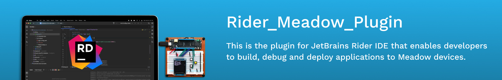

# Rider_Meadow_Plugin

This plugin enables you to build, debug, and deploy Meadow applications directly from JetBrains Rider. It integrates with Rider's IDE features to provide a native development experience for Meadow projects.

# Build Status
[](https://github.com/WildernessLabs/Rider_Meadow_Plugin/actions)

# Download Plugin
[](https://plugins.jetbrains.com/plugin/RiderMeadowPlugin)

# Download Rider
[](https://www.jetbrains.com/rider/download/)

## Architecture

### Debug Adapter Protocol (DAP)

Like the VSCode and Visual Studio extensions, the Rider plugin uses the Debug Adapter Protocol for all debugging operations. When you start a debug session, here's what happens:

1. The plugin launches the DAP adapter process
2. The adapter handles deployment to your Meadow device
3. Debug events flow back to Rider's debug UI through the adapter
4. When you stop debugging, the adapter cleanly closes the connection and resumes your device

This shared architecture means the debugging experience is consistent whether you're using Rider, Visual Studio, or VSCode. The plugin focuses on Rider-specific UI integration (run configurations, gutter icons, debug toolbar), while the actual debugging is handled by shared code in the Meadow.Debugging repository.

### Plugin Structure

The plugin consists of two parts working together:

The frontend (Kotlin) handles the Rider UI integration. It provides the run configurations, device selection, build system integration, and communicates with Rider's debug UI.

The backend (C#) is the DAP adapter, compiled from the Meadow.Debugging repository. This handles all device communication, deployment, and debugging protocol details.

When you hit the debug button in Rider, the frontend prepares the launch configuration and passes it to Rider's debug system. The backend adapter then takes over, managing the actual device deployment and debugging session. The frontend doesn't need to know the details of what's happening on the device. It just needs to show the debug events and UI controls that come back from the adapter.

### Why DAP for Everyone

Before DAP, each IDE would have its own debugging implementation. That meant a bug fixed in Rider might not get fixed in VSCode. Now we maintain a single debugging codebase that benefits all three IDEs. This is a huge win for consistency and maintenance. When something works in Rider, it works the same way in Visual Studio and VSCode.

## Release Notes

### 1.0.0

Initial release of the Rider plugin for Meadow from Wilderness Labs.

Key features:
- Integrated device deployment and debugging
- Unified DAP-based debugging shared with VSCode and Visual Studio
- Debug sessions properly clean up when stopped, allowing immediate redeployment without device reset
- Native Rider UI integration with run configurations and debug toolbar 

## Getting Started

If you want to start developing the plugin, execute this shell command:

```console
./gradlew prepare
```

This downloads the initial dependencies and sets up the Rider SDK for the .NET part of the plugin. After that, you can open either the frontend (the directory containing build.gradle.kts) using IntelliJ IDEA, or the Rider_Meadow_Plugin.sln file using Rider.

The plugin integrates with both the Gradle build system (for the Kotlin frontend) and the .sln project structure (for the C# backend). Understanding both build systems is useful for development.

## Contributor Guide

### Prerequisites

The following are downloaded automatically during the build:
- .NET SDK 8.0 or later (for the C# DAP adapter backend)
- JDK (automatically fetched by Gradle)

### Setup

Clone the necessary repository in a sibling folder:

```console
git clone git@github.com/WildernessLabs/Meadow.CLI.git
```

This repository contains shared code used by the plugin.

### Build

To build the plugin, execute this shell command:

```console
./gradlew buildPlugin
```

The build system will automatically download the recommended JDK version and Gradle version. If you prefer to use your own versions, you can run `gradle buildPlugin` directly.

After the build completes, the plugin ZIP distribution will be created in the build/distributions directory.

### Run IDE

To build and test the plugin in a sandboxed instance of Rider:

```console
./gradlew runIde
```

This launches a fresh Rider instance with your plugin code loaded, so you can test the UI integration, run configurations, and any IDE interaction without affecting your main Rider installation.

### Test

To run the test suite:

```console
./gradlew :check
```

## Development

### IntelliJ IDEA Setup

After running `./gradlew` at least once, configure your project SDK to use the gradle-jvm folder:

- Windows: `%LOCALAPPDATA%\gradle-jvm`
- Unix-based OS: `${HOME}/.local/share/gradle-jvm`

This JDK contains all components needed to build the plugin.

### Frontend vs Backend

The plugin is split into two development areas:

**Frontend (Kotlin)**: Open the root directory with IntelliJ IDEA for UI development. This handles the Rider UI integration, run configurations, device selection, and debug toolbar interactions.

**Backend (C#)**: Open Rider_Meadow_Plugin.sln with JetBrains Rider for backend development. This is where the DAP adapter logic lives, handling device communication, debugging protocol implementation, and deployment.

Both parts communicate through the DAP protocol. If you're making changes to how debugging works, that's likely a backend change. If you're adding UI features, that's likely a frontend change.

### Understanding the DAP Integration

When you debug a Meadow project in Rider, the flow is:

1. User clicks the Debug button or uses a run configuration
2. Rider's UI (Kotlin frontend) prepares the launch parameters
3. The frontend invokes Rider's debug framework, passing those parameters
4. Rider's debug framework launches the C# backend (DAP adapter)
5. The backend handles all device communication and debugging
6. Debug events flow back through the adapter to Rider's debug UI
7. User sees breakpoints, variables, call stacks, etc. in Rider's debug panels

The frontend only needs to know how to construct the launch configuration. It doesn't need to understand the complexities of device deployment or Mono debugging. That's all handled by the backend adapter.